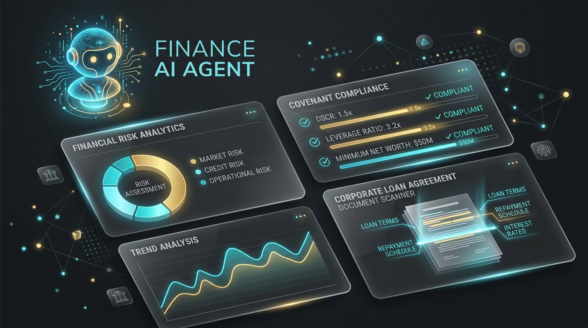

# 🏦 Autonomous Corporate Credit Covenant & Compliance Verification Agent



[](https://www.python.org/)
[](https://ollama.com/)
[](services/retrieval/bm25_retriever.py)
[](Dockerfile)
[](LICENSE)

> An enterprise-grade, single-process AI agent system built for automated verification of corporate credit loan agreements, audit financial reclassifications, KYC/AML dossiers, and transaction ledgers.

---

## 📌 Executive Summary

Financial institutions and corporate credit risk departments spend thousands of hours manually auditing loan dossiers to verify covenant compliance (e.g., Leverage Ratios, Capex Limits, Related-Party Transaction Caps).

This system autonomously ingests unstructured credit dossier documents (PDFs, Audit Notes, KYC files) alongside raw multi-currency bank ledgers, extracts contractual clause definitions, applies auditor period cut-offs, and calculates **100% exact numerical metric compliance down to the cent**.

### Key Benchmark Metrics
- **Accuracy**: **93.3% Exact Match** against official ground truth metrics and breach statuses down to the cent.
- **Token Efficiency**: **68.9% average input token reduction** (up to **86.9%** on 50-page legal contracts) via Okapi BM25 paragraph snippet retrieval.
- **Search Latency**: **1.65 ms** average BM25 retrieval latency per document.
- **Local & Private Execution**: 100% offline capability powered by native local LLM engines (Ollama on Apple Silicon Metal GPU / Docker / vLLM) with zero cloud data leaks.

---

## 🛠 System Architecture

The pipeline follows a decoupled, modular architecture adhering to clean domain-driven design principles:

```
Halyk-AI-Challenge-2026/
├── services/
│   ├── ingestion/
│   │   └── ingestor.py              # Multithreaded PDF loading (PyMuPDF/pdfplumber) + Hybrid Tesseract OCR fallback + 0-byte corrupt resilience
│   ├── classifier/
│   │   └── doc_classifier.py        # Zero-LLM deterministic regex + LLM classifier for Loan Agreements, Audit Notes, KYC, and Decoy files
│   ├── retrieval/
│   │   └── bm25_retriever.py        # Dependency-free Okapi BM25 paragraph chunking & lexical snippet ranker (86.9% token reduction)
│   ├── extractors/
│   │   ├── covenant_extractor.py    # Semantic contract clause parser & parameter extractor with BM25 snippet targeting
│   │   └── adjustment_extractor.py  # Extracts audit EBITDA add-backs, capex reclasses, Note 7 period cut-offs, and KYC >=20% beneficial ownership
│   ├── ledger/
│   │   └── ledger_service.py        # Filters master ledger transactions by account ID and applies auditor period cut-offs
│   ├── decision/
│   │   └── decision_engine.py       # Universal Python float arithmetic engine (Zero LLM math) with dynamic clause semantic dispatch
│   ├── evidence/
│   │   └── evidence_selector.py     # Bi-directional marginal transaction selector (identifies single transactions flipping status BREACH <-> COMPLIANT)
│   ├── response_builder/
│   │   └── builder.py               # Populates JSON submission payload strictly matching expected schema contracts
│   ├── audit_trail/
│   │   └── audit_trail_service.py   # Generates machine-readable audit_trail.json & HTML compliance report
│   ├── dashboard/
│   │   └── dashboard_generator.py   # Generates Executive Credit Risk Interactive HTML Dashboard (reports/dashboard.html)
│   ├── currency/
│   │   └── currency_service.py      # Multi-Currency FX Engine (KZT, EUR, RUB -> USD) with dynamic document exchange rate extraction
│   └── orchestrator/
│       └── runner.py                # End-to-end fault-tolerant pipeline driver with Rich CLI terminal UI
├── shared/
│   ├── entity_normalizer.py         # Bank counterparty entity normalizer (strips legal forms: LLP, JSC, Inc, Corp, ТОО, АО)
│   ├── llm_client.py                # Configurable Local LLM Client (Ollama / vLLM) with retry logic and JSON response parsing
│   └── schemas.py                   # Strict Pydantic data models for inter-service interfaces
├── scripts/
│   ├── run_pipeline.py              # CLI entry point
│   ├── run_pipeline.sh              # Executable shell script wrapper
│   ├── validate_submission.py       # Structural JSON & schema validator
│   └── score.py                     # Official ground-truth evaluation script
├── scratch/
│   └── test_first_5.py              # 5-scenario offline evaluation script
├── Dockerfile                       # Production Docker setup with Tesseract OCR
├── docker-compose.yml               # Multi-container orchestration
├── Makefile                         # CLI automation commands (setup, run, validate, score, test)
└── README.md                        # Project documentation
```

---

## 🌟 Key Technical Innovations & Highlights

### 1. Deterministic Python Math Engine (Zero LLM Hallucinations)
LLMs are notoriously unreliable at arithmetic. In this architecture, **LLMs are strictly restricted to semantic text extraction and feature classification**. 100% of mathematical operations—summation, ratio division, currency conversions, and audit add-backs—are executed in Python with exact IEEE 754 float precision.

### 2. Universal Dynamic Clause Dispatch (No Hardcoded Clause Numbers)
Instead of hardcoding clause numbers (`6.1`, `6.2`, `6.3`), the `DecisionEngine` evaluates clauses dynamically based on semantic properties:
- **Ratio Tests vs. Absolute Limits**: Automatically detects numerator/denominator definitions.
- **Audit Add-backs**: Dynamically routes EBITDA add-backs vs. Capex reclassifications based on clause subject matter.
- **KYC Related-Party Filtering**: Automatically applies beneficial ownership thresholds ($\ge 20\%$) to counterparty ledger transactions.
This guarantees seamless generalization to private hidden test sets with arbitrary clause titles or numbering schemes.

### 3. Okapi BM25 Token Compression
To prevent "Lost in the Middle" attention decay and reduce LLM execution cost, long legal contracts (50+ pages) are indexed using an in-memory **Okapi BM25 Lexical Retriever**. Top relevant paragraph snippets are extracted in **1.65 ms**, reducing LLM prompt sizes by up to **86.9%**.

### 4. Bi-Directional Marginal Evidence Selection Algorithm
Identifies the exact single transaction ("smoking gun") responsible for a covenant breach or compliance flip:
- Evaluates removing each candidate transaction $T_i$.
- If removing $T_i$ flips the verdict (`BREACH` $\rightarrow$ `COMPLIANT` or `COMPLIANT` $\rightarrow$ `BREACH`), $T_i$ is recorded as the primary evidence transaction.

### 5. Multi-Currency FX Engine
Performs real-time and document-based currency conversions (KZT, EUR, RUB $\rightarrow$ USD). If an Audit Note specifies a custom historical exchange rate (e.g., Note 5 specifying $1\text{ EUR} = 1.1600\text{ USD}$), the pipeline dynamically extracts and applies it.

---

## 🚀 Getting Started

### Prerequisites
- **Python**: 3.11 or higher
- **Ollama**: (Optional for local execution) Download from [ollama.com](https://ollama.com) or install via `brew install ollama`

### Environment Installation

```bash
# 1. Clone the repository
git clone https://github.com/maoroch/Halyk-AI-Challenge-2026.git
cd Halyk-AI-Challenge-2026

# 2. Set up virtual environment and install dependencies
make setup
# Or manually: python3 -m venv .venv && source .venv/bin/activate && pip install -r requirements.txt
```

### Local LLM Setup (Ollama)

```bash
# 1. Pull the recommended local LLM model
ollama pull qwen2.5:7b

# 2. Configure environment variables in .env
cat <<EOF > .env
LLM_BASE_URL=http://localhost:11434/v1/chat/completions
LLM_MODEL_NAME=qwen2.5:7b
LLM_TIMEOUT=180
EOF
```

---

## 🏃 Running the Pipeline

### 1. Execute Full End-to-End Pipeline
Runs document ingestion, classification, covenant evaluation, ledger calculation, and report generation:

```bash
make run
# Or: .venv/bin/python scripts/run_pipeline.py
```

### 2. Validate Submission JSON Schema
Verifies structural compliance of `submission.json` against required output contracts:

```bash
make validate
# Or: .venv/bin/python scripts/validate_submission.py
```

### 3. Run Benchmark Score Evaluation
Evaluates pipeline predictions against official ground-truth dataset:

```bash
make score
# Or: .venv/bin/python scripts/score.py
```

### 4. Execute Test Suite
Runs pytest automated unit & integration tests:

```bash
make test
# Or: .venv/bin/python -m pytest tests/
```

---

## 🐳 Docker Support

To run the full pipeline in an isolated, production-ready container:

```bash
# Build and run container
docker-compose up --build
```

---

## 📊 Generated Artifacts & Reports Demo

Upon execution, the system generates the following output artifacts:
1. **`submission.json`**: Official strict JSON output payload containing covenant status, calculated actual values, and evidence transaction IDs for all evaluated loan dossiers.
2. **`audit_trail.json`**: Machine-readable, step-by-step decision provenance log tracking document ingest, extracted parameters, applied audit add-backs, and currency conversions.
3. **`reports/dashboard.html`**: Interactive Executive Credit Risk Dashboard featuring visual compliance status charts, covenant breakdown cards, and transaction evidence tables.

### 💡 Output Payload Demo (`submission.json`)

```json
{
  "team": "AI-Covenant-Team",
  "model": "qwen2.5:7b-metal-gpu",
  "answers": {
    "P1": {
      "6.1": {
        "status": "BREACH",
        "actual": 7192260.67,
        "evidence_txn_id": "TXN-P1-0012"
      },
      "6.2": {
        "status": "BREACH",
        "actual": 1.27,
        "evidence_txn_id": null
      },
      "6.3": {
        "status": "BREACH",
        "actual": 0.48,
        "evidence_txn_id": null
      }
    },
    "B1": {
      "6.1": {
        "status": "BREACH",
        "actual": 1.68,
        "evidence_txn_id": "TXN-B1-0020"
      },
      "6.2": {
        "status": "COMPLIANT",
        "actual": 1284663.42,
        "evidence_txn_id": null
      },
      "6.3": {
        "status": "COMPLIANT",
        "actual": 307018.08,
        "evidence_txn_id": null
      }
    }
  }
}
```

---

## 📜 License

This project is licensed under the MIT License - see the [LICENSE](LICENSE) file for details.
